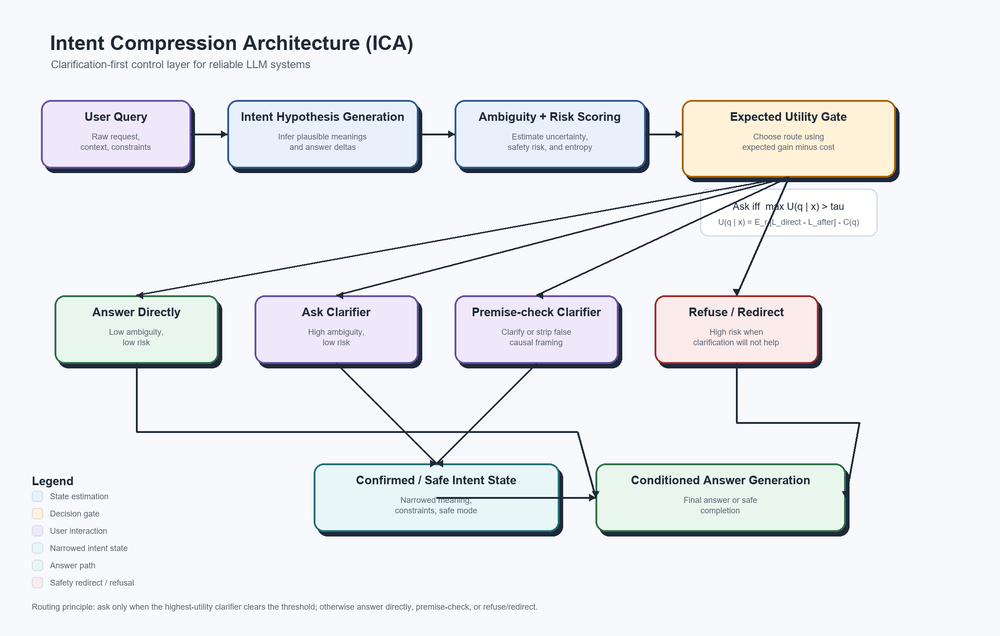

# Intent Compression Architecture: A Control Plane for Intent in Reliable LLM Systems

**Author:** Paul Maddison  
**Email:** paul.maddison.delimeg@gmail.com  
**LinkedIn:** https://www.linkedin.com/in/paul-maddison-b83395175/

**Short name:** ICA

## Abstract

Intent Compression Architecture (ICA) is a **pre-generation control layer** for LLM systems.
Its job is to decide whether ambiguity should be resolved before the model commits to an answer.
More generally, ICA is a **control plane for intent**: it keeps the model focused on the meaning that matters before answer generation or agent action.

The key claim is simple:

> **Ask a clarifying question only when the expected improvement in answer quality or safety exceeds the cost of another turn.**

That framing turns clarification from a vague conversational instinct into an engineering policy.
ICA is therefore not "ask more questions."
It is a routing, scoring, and control problem that sits between user input and final generation.

---

## The crux: the first answer becomes evidence

The core failure is not just that the model may need a retry.
The deeper problem is that many users never reach the retry.

A user asks an ambiguous question.
The assistant answers under one implied meaning.
The user leaves, accepts the answer, or screenshots it.
That first answer can then be reused as evidence for a claim the model never actually resolved.

The Elon Musk propaganda example is the minimal demo.
The answer changes depending on whether `propaganda` means:

- biased or one-sided political messaging
- coordinated deceptive messaging
- deliberate misinformation or manipulation

Without clarification, a cautious answer can still be cropped into:

```text
ChatGPT agrees with me.
```

ICA exists to prevent that failure mode.
When a load-bearing word changes the answer, the system should resolve the word before generating the answer.

---

## Claim ladder

1. **Weak claim**
Clarifying questions can improve some ambiguous conversations.

2. **Engineering claim**
A control layer can decide when clarification has positive expected utility.

3. **Evaluation claim**
ICA should be measured by tokens per resolved intent, not first-pass answer length.

4. **Safety claim**
Ambiguity and intent risk should be scored separately before generation.

5. **Strategic claim**
At large scale, clarification traces become structured intent-resolution data.

6. **Moat claim**
The architecture is copyable; the trained clarification policy and clarification data flywheel are harder to copy.

---

## Problem statement

A common failure mode in AI conversations is **unresolved ambiguity**.

Users often ask questions that admit multiple plausible interpretations.
Many systems are optimized to answer immediately, even when the intended meaning is still uncertain.
The result is a familiar pattern:

1. the model guesses
2. the answer broadens to cover multiple interpretations
3. the user corrects the guess
4. the model regenerates

That loop wastes tokens, increases latency, weakens precision, and makes the product feel less reliable than it should.

ICA is designed to break that loop.

---

## What ICA is

ICA is best understood as a **clarification-first control layer** that sits in front of answer generation.

It performs four jobs:

1. infer likely intent hypotheses
2. estimate ambiguity and risk
3. decide whether clarification is worth the extra turn
4. either answer directly, ask a clarifier, premise-check, or refuse/redirect

In that framing:

- **Humans provide intent**
- **Agent orchestration should be deterministic where possible**
- **Uncertainty should be isolated to model calls and external-system calls**

So the stack is:

Human intent<br>
↓<br>
Deterministic software where possible<br>
↓<br>
Probabilistic model<br>
↓<br>
Tool/API/database execution

This is the foundation of ICA.

---

## Why the name includes "compression"

The word **compression** should be taken literally, not metaphorically.

ICA treats ambiguity as entropy over possible user intents.
Let $I$ be the latent intent variable and $x$ be the user query.

Before clarification:

$$
H(I \mid x)
$$

After asking clarification $q$ and observing reply $r$:

$$
H(I \mid x, q, r)
$$

The value of a clarification is the expected reduction in intent entropy:

$$
IG(q) = H(I \mid x) - \mathbb{E}_{r \sim P(r \mid x, q)}[H(I \mid x, q, r)]
$$

So ICA **compresses the intent distribution before generation**.
It narrows the model's uncertainty set before the answer is produced.

That is the mathematical justification for the project name.

---

## Decision policy: ask vs answer

### Minimal rule

> Ask a clarifying question only when expected improvement in answer quality or safety exceeds the cost of another turn.

### Expected-utility formulation

For each candidate clarification question $q$, define:

$$
U(q \mid x) = \mathbb{E}_{r \sim P(r \mid x, q)}\left[L_{\text{direct}}(x) - L_{\text{after}}(x, q, r)\right] - C(q)
$$

Where:

- $x$ is the user query
- $r$ is the user's possible reply to clarification $q$
- $L_{\text{direct}}(x)$ is the expected loss from answering immediately
- $L_{\text{after}}(x, q, r)$ is the expected loss after receiving reply $r$
- $C(q)$ is the cost of asking the question

The routing rule becomes:

$$
\text{Ask iff } \max_q U(q \mid x) > \tau
$$

Where $\tau$ is a domain-specific threshold.

Plain English:

> Ask the clarification question with the highest expected utility, but only if its expected gain clears a threshold.

### Estimating entropy and utility in practice

The schema fields `intent_entropy_bits` and `intent_hypotheses[].probability` should not be read as magical model self-knowledge.
In a production implementation, they should be treated as calibrated control-layer estimates.

A practical estimator has four stages:

1. **Hypothesis generation**
Generate a small set of mutually exclusive, answer-changing intent hypotheses.
The hypotheses should include an `other` bucket so the distribution is not forced to overfit the visible options.

2. **Probability estimation**
Estimate $P(I_i \mid x)$ using a calibrated classifier, model logprob features where available, retrieval/context features, or repeated low-temperature samples clustered by semantic equivalence.
The first version can use model-estimated probabilities, but it should be instrumented as an uncalibrated prior rather than accepted as ground truth.

3. **Calibration**
Calibrate the probabilities against labeled ambiguity data using Brier score, expected calibration error, and reliability plots.
If the model says a hypothesis has probability 0.7, roughly 70% of those cases should resolve to that hypothesis on held-out traffic.

4. **Entropy calculation**
Compute entropy mechanically:

$$
H(I \mid x) = - \sum_i P(I_i \mid x)\log_2 P(I_i \mid x)
$$

The mock provider in this repository demonstrates the final mechanical step by computing entropy from declared hypothesis probabilities.
That is sufficient for tests, but not sufficient for production.
Production ICA needs calibration data, confidence intervals, and regular audits of cases where the user reply selects `other` or contradicts all proposed hypotheses.

Candidate utility should be estimated in the same spirit.
The implementation in [`src/ica_core/policy.py`](src/ica_core/policy.py) treats provider-estimated clarifier benefit as only one input, then applies deterministic local adjustments for token cost, latency cost, turn friction, and optional risk adjustment.
That keeps the ask-vs-answer decision auditable even when the upstream probability estimates are noisy.

### Calibrating tau

The threshold $\tau$ should be learned or tuned, not chosen by taste.
The simplest offline calibration is a grid search over a labeled benchmark:

$$
\tau^* = \arg\min_{\tau} \sum_j L(\text{route}_{\tau}(x_j), y_j)
$$

Where the loss includes at least:

- cost of unnecessary clarification
- cost of answering directly when clarification was needed
- cost of refusing or over-constraining when a safe direct answer was possible
- token, latency, and abandonment costs
- safety or compliance cost for risky wrong answers

A rough starting heuristic:

- **coding and data tasks:** lower $\tau$ when a short clarifier can prevent a long wrong implementation
- **high-volume support:** higher $\tau$ when users abandon easily and the cost of a wrong answer is low
- **medical, legal, finance, and safety-sensitive advice:** lower $\tau$ for missing context that changes safe guidance, but route clear policy violations directly to refusal or safe redirection
- **creative or brainstorming tasks:** higher $\tau$ unless the ambiguity materially changes the deliverable

Worked example:

- best clarifier benefit estimate: `0.36`
- token/latency/friction cost: `0.11`
- risk adjustment: `0.04`
- adjusted utility: `0.36 - 0.11 + 0.04 = 0.29`
- if domain $\tau = 0.15$, ask
- if domain $\tau = 0.35$, answer directly or state assumptions

The main operational dashboard should track the threshold's two failure modes:
over-clarification when $\tau$ is too low, and silent wrong-funnel answers when $\tau$ is too high.

That threshold is important.
It lets the same architecture behave differently across domains:

- coding tools can tolerate one short clarifier to avoid a long wrong answer
- medical or legal systems can set a higher penalty on error and a lower tolerance for unsafe direct answers
- high-volume customer support systems can weight latency more heavily

---

## Cost function

Clarification is not free, but neither is guessing.

One simple objective is:

$$
L = \alpha \cdot \text{error} + \beta \cdot \text{tokens} + \gamma \cdot \text{latency} + \delta \cdot \text{user friction} + \epsilon \cdot \text{safety risk}
$$

This makes the tradeoff explicit:

- better accuracy and safer answers
- versus
- extra interaction cost

The value of ICA is not that it always asks.
The value is that it decides when clarification is worth paying for.

---

## Question selection strategy

Not all clarifying questions are equally useful.
If the system decides to ask, it should choose the question that most efficiently collapses the ambiguity space.

Two equivalent views are useful:

1. **Information-gain view**

$$
q^* = \arg\max_q IG(q)
$$

2. **Utility view**

$$
q^* = \arg\max_q U(q \mid x)
$$

In practice, the utility view is stronger because it balances entropy reduction against real interaction cost.

Good clarifiers:

- separate the most plausible competing intents
- use neutral wording
- avoid injecting assumptions
- minimize token count and user effort
- materially change the likely final answer

Bad clarifiers:

- ask for information that will not change the answer
- present loaded or leading framings
- require long explanations when a short disambiguation would suffice
- confirm harmful intent when the safe response would not change anyway

So the goal is not "ask a question."
The goal is "ask the smallest question that meaningfully changes the answer."

---

## Risk-aware routing policy

ICA should reason over **both** meaning uncertainty and intent risk.

Some prompts are ambiguous but low risk.
Some are semantically clear but high risk.
A strong control layer should distinguish those cases explicitly.

| Ambiguity | Risk | Default action | Rationale |
| --- | --- | --- | --- |
| Low | Low | Answer directly | No clarification needed. |
| High | Low | Ask one high-value clarifier | Reduce ambiguity before generation. |
| Low | High | Direct safe completion, refuse/redirect, or premise-check if safe behavior can materially change | Do not confirm harmful intent unless confirmation changes the safe response. |
| High | High | Strict clarification, constrained answering, or refuse/redirect | High uncertainty plus high downside requires tighter control. |

Two important safety notes follow from this:

1. **Clarification is not always the right response to risk.**
Sometimes the best behavior is a direct safe completion or a refusal with a helpful redirect.

2. **The system should not ask the user to confirm harmful intent when confirmation would not change the safe response.**
In those cases, refusal or redirection is cleaner and safer.

---

## System architecture



The updated diagram reflects the current architecture claim:

- intent hypotheses are generated first
- ambiguity and risk are scored jointly
- an expected-utility gate decides whether to answer, clarify, premise-check, or refuse/redirect
- the final answer is conditioned on either the direct route or a narrowed intent state

The legend is embedded directly in the figure so the diagram remains understandable when reused outside the README.

---

## Positioning against prior work

ICA is closest to work on selective clarification for ambiguous questions, but it makes a different architecture claim.

- [CLAM: Selective Clarification for Ambiguous Questions with Generative Language Models](https://arxiv.org/abs/2212.07769) shows that language models can be prompted to detect ambiguity, ask clarifying questions, and answer after clarification.
- [CLAMBER: A Benchmark of Identifying and Clarifying Ambiguous Information Needs in Large Language Models](https://arxiv.org/abs/2405.12063) evaluates whether LLMs can identify ambiguous user queries and ask useful clarifying questions, and reports that current models still struggle even with CoT and few-shot prompting.
- [AmbigQA](https://arxiv.org/abs/2004.10645) frames ambiguity in open-domain QA as a task of finding plausible answers and rewriting questions to resolve ambiguity.
- [ReAct](https://arxiv.org/abs/2210.03629) interleaves reasoning and actions so models can gather information and update plans during task execution.
- [Self-Consistency](https://arxiv.org/abs/2203.11171) and semantic-entropy work such as [Semantic Uncertainty](https://arxiv.org/abs/2302.09664) show that sampling and semantic clustering can expose uncertainty signals in generated reasoning or answers.

ICA's intended contribution is narrower and more software-architectural:

- it turns clarification into a pre-generation routing contract rather than a prompting behavior alone
- it separates ambiguity, risk, utility, and final answer generation into inspectable stages
- it uses expected utility and a calibrated threshold to decide when not to ask
- it treats clarification traces as structured intent-resolution data for improving the controller over time
- it defines counter-metrics such as over-clarification, false direct answer, false refusal, and silent-failure proxy

So ICA does not claim that clarification is new.
The claim is that clarification should be engineered as a calibrated control layer with measurable routing decisions.

---

## Implementation contract

To make ICA directly buildable, the control layer should emit a structured decision object rather than a free-form paragraph.

Schema:

- [`spec/clarifier_output.schema.json`](spec/clarifier_output.schema.json)

Reference example:

- [`spec/clarifier_output.example.json`](spec/clarifier_output.example.json)

Validation command:

```bash
python scripts/validate_schema.py
```

The schema uses a canonical repo URL as its `$id`, and the example is intended to be machine-valid rather
than illustrative only.

This check can be run locally:

```bash
python scripts/validate_schema.py
```

Local validation is the canonical reproducibility path for this repository.

Illustrative payload:

```json
{
  "ambiguity_score": 0.74,
  "risk_score": 0.22,
  "intent_entropy_bits": 1.41,
  "intent_hypotheses": [
    {
      "label": "persuasive political advocacy",
      "probability": 0.46,
      "answer_delta_if_true": "high"
    },
    {
      "label": "coordinated deceptive messaging",
      "probability": 0.39,
      "answer_delta_if_true": "high"
    },
    {
      "label": "other",
      "probability": 0.15,
      "answer_delta_if_true": "medium"
    }
  ],
  "decision": "ask_clarifier",
  "clarifying_question": "When you say propaganda, do you mean persuasive political advocacy, coordinated deceptive messaging, or something else?",
  "answer_constraints": [
    "avoid loaded framing",
    "define terms before conclusion"
  ]
}
```

This is a small addition, but it matters.
It turns ICA from a conceptual recommendation into a concrete orchestration contract.

---

## Repository implementation

The repo includes both the design proposal and a small Python package, `ica-core`, that implements the ICA control layer as reusable library code.
This section is for readers who want to run or extend the implementation after understanding the argument.

### Primary artifacts

- Proposal PDF: [`ICA_Engineering_Design_Proposal1.pdf`](ICA_Engineering_Design_Proposal1.pdf)
- Proposal DOCX source: [`ICA_Engineering_Design_Proposal1.docx`](ICA_Engineering_Design_Proposal1.docx)
- Architecture diagram: [`diagrams/architecture.png`](diagrams/architecture.png)
- Clarifier contract schema: [`spec/clarifier_output.schema.json`](spec/clarifier_output.schema.json)
- Clarifier contract example: [`spec/clarifier_output.example.json`](spec/clarifier_output.example.json)
- Benchmark prompt set: [`examples/ambiguous_prompts.csv`](examples/ambiguous_prompts.csv)
- Evaluation protocol: [`eval/README.md`](eval/README.md)
- Sample reporting format: [`eval/sample_results.md`](eval/sample_results.md)
- Pilot benchmark report: [`eval/pilot_results.md`](eval/pilot_results.md)
- Pilot benchmark data table: [`eval/pilot_results.csv`](eval/pilot_results.csv)

### Quick start

```bash
python -m pip install -r requirements.txt
python -m pip install -e ".[dev]"
bash scripts/validate_local.sh
```

For a more exact replay of the currently documented environment, use `requirements.lock` instead of
`requirements.txt`.

On Windows PowerShell, use:

```powershell
python -m pip install -r requirements.txt
python -m pip install -e ".[dev]"
./scripts/validate_local.ps1
```

If you need to target a specific interpreter, set `PYTHON` first and then run the same helper script.

### Python package: `ica-core`

`ica-core` is not a hosted SaaS product and it is not tied to one model provider.
The package is intended to be the local foundation for:

- a Python library used inside LLM applications
- a later self-hosted gateway layer, such as `ica-gateway`
- provider adapters that return the structured ICA decision contract

The package follows the architecture described in this repository:

- model calls estimate ambiguity, risk, intent hypotheses, and candidate clarifiers
- deterministic policy code applies the ask-vs-answer rule
- ambiguity and risk are represented separately
- false-premise and refusal paths are distinct from ordinary clarification
- traces are opt-in and privacy-conscious by default

Clarification-first control matters because an apparently cheap first answer can be expensive if it sends the conversation into a correction funnel.
ICA therefore measures cost at the level of **tokens per resolved intent**: the total token and interaction cost required to reach the user's intended task, including clarification or repair turns.
The pilot/eval material in [`eval/`](eval/) illustrates this comparison at a small benchmark scale; it should be treated as an initial reproducible pilot, not a universal production claim.

### Install for development

```bash
python -m pip install -e ".[dev]"
```

Run the test suite:

```bash
python -m pytest
```

Build the package locally:

```bash
python -m build
```

### CLI demo

After editable install, run:

```bash
ica "Does Elon Musk post right-wing propaganda?"
```

Or without relying on your shell `PATH`:

```bash
python -m ica_core.cli "Make this API faster."
python -m ica_core.cli --json "Make this API faster."
python -m ica_core.cli --trace --trace-path ica-traces.jsonl "Make this API faster."
python examples/cli_demo.py
```

The default provider is the offline mock provider, so the CLI and tests do not require live API access.
Live OpenAI/xAI calls are not validated in this release because no real provider API key is configured.

### Python API

```python
from ica_core import IntentCompressor, MockIntentProvider, PolicyConfig

compressor = IntentCompressor(
    provider=MockIntentProvider(),
    policy_config=PolicyConfig(tau=0.15),
)

decision = compressor.process(
    "Make this API faster.",
    trace_id="demo-001",
    metadata={"domain": "coding"},
)

print(decision.decision)
print(decision.clarifying_question)
```

### Provider support

Current provider support is intentionally conservative:

- `mock`: implemented, deterministic, offline, suitable for tests and demos
- OpenAI/xAI/other providers: not bundled yet; the provider interface is ready for adapters that implement `generate_structured`

Provider API key settings are available for future adapters using the providers' normal environment variable names, such as `OPENAI_API_KEY` and `XAI_API_KEY`.
No real API key is hardcoded or required.

### Tracing and privacy

Tracing is off by default.
When enabled with `--trace`, `ica-core` writes local JSONL traces and stores a query hash by default, not the raw query.
You can choose redacted or raw query capture explicitly with `--trace-query`, and request metadata is excluded unless `--trace-metadata` is set.
This is meant to support the clarification-data-flywheel idea without pretending that local traces solve retention, consent, or privacy policy by themselves.

### Current limitations

- The mock provider uses simple heuristics, not calibrated production probability estimates.
- The expected-utility policy uses a practical approximation documented in code.
- There is no hosted gateway, persistence service, or provider SDK adapter yet.
- The pilot benchmark is useful for design validation, but broader multi-rater and production-instrumented evaluation is still needed.

Release notes are tracked in [`CHANGELOG.md`](CHANGELOG.md).

---

## Why this is also a software architecture issue

This repo treats "agents" as software systems, not mystical entities.

An agent loop is usually ordinary program logic:

```python
while not done:
    state = read_state()
    step = policy(state)          # deterministic control logic where possible
    result = call_model_or_tool(step)
    update_state(result)
```

In a well-designed system, orchestration should be deterministic where possible.
Real agent systems still contain nondeterministic dependencies, including:

- model sampling
- retrieval ranking
- external API state
- timeouts
- race conditions

So the strong claim is not that every real system is fully deterministic.
It is that uncertainty should be isolated to model and external-system calls while the control logic remains explicit, inspectable, and testable.

ICA is therefore a deterministic orchestration improvement around probabilistic model calls.

---

## Illustrative token and latency impact

The following numbers are **illustrative rather than benchmarked**.
They show why selective clarification can reduce total cost.

Typical ambiguous loop:

- prompt: 200 tokens
- broad first answer: 1200 tokens
- user correction: 150 tokens
- second answer: 1000 tokens
- **total: 2550 tokens**

ICA loop:

- prompt: 200 tokens
- clarification question: 20 tokens
- user clarification: 30 tokens
- precise final answer: 500 tokens
- **total: 750 tokens**

At scale, that difference matters financially and operationally.

In ambiguous cases, **better questions can beat bigger answers**.

---

## Hidden baseline cost: correction funnels and silent failure

A low-token first answer is not necessarily an efficient answer.

In ambiguous prompts, the baseline model often chooses one interpretation implicitly and answers under that interpretation.
If the user meant something else, the conversation can enter a **correction funnel**:

1. the model answers the wrong version of the question
2. the user challenges the answer
3. the model defends or qualifies its interpretation
4. only later does the real issue become explicit: a load-bearing term was never defined

This is not just a retry problem.
It is a **wrong-funnel problem**.

Example pattern:

1. user asks: "Does Elon Musk post right-wing propaganda?"
2. model answers under one narrow definition of "propaganda"
3. user argues from a different definition
4. several turns later, the system finally reveals the real issue: the term "propaganda" was carrying multiple meanings

ICA moves that discovery to the front.
It exposes the load-bearing ambiguity before the system commits to an answer.

This matters because many users will not litigate the answer into correctness.
There are two baseline failure modes:

1. **Correction funnel**
The user pushes back, burns time and tokens, and eventually forces the model to discover the ambiguity.

2. **Silent failure**
The user does not push back, accepts or abandons the answer, and never learns that the answer depended on an undefined term.

So ICA should not be evaluated only on first-pass output tokens.
It should be evaluated on **tokens per resolved intent**:

`total cost = first answer + repair turns + user correction burden + silent-failure risk`

A short wrong answer is not cheaper than a short clarifying question if the answer sends the user down the wrong semantic funnel.

---

## Human-behavior risk: early exits and screenshot misuse

The correction funnel is only visible when the user keeps arguing.
Many real users will not.

That creates a separate product and safety risk:

1. the assistant answers under one implied definition
2. the user leaves before the ambiguity is exposed
3. the first answer is accepted, abandoned, or screenshotted
4. the screenshot is reused as evidence for a contested claim

The propaganda example demonstrates the pattern.
If the user asks whether Elon Musk posts "right-wing propaganda," the answer depends heavily on whether "propaganda" means:

- biased or one-sided political messaging
- coordinated deceptive messaging
- deliberate misinformation or manipulation

A default answer can be cautious and technically reasonable while still failing the interaction.
If the first answer can be cropped into "ChatGPT agrees this is not propaganda" or "ChatGPT agrees this is propaganda," the system has created a quote-mining surface.

ICA's preferred route is to collapse the load-bearing definition before the answer:

```text
User: Is Elon Musk spreading right-wing propaganda?
Assistant: Do you mean propaganda as in biased or one-sided political messaging intended to influence opinion?
User: Yes.
Assistant: Under that definition, some of his political posts can reasonably be described that way, while non-political posts and ordinary opinion should be separated from that claim.
```

The goal is not to force neutrality by vagueness.
The goal is to prevent a screenshotable first answer from becoming social proof for a meaning the user and model never agreed on.

The benchmark therefore tracks not only retries, but also:

- early-exit silent-failure risk
- screenshot misuse risk
- definition-discovery turn
- whether clarification materially changed the final answer

---

## Evaluation package

The next credibility jump is stronger empirical support: a multi-rater or live-user benchmark.
This repo now includes a lightweight benchmark scaffold:

- prompt set: [`examples/ambiguous_prompts.csv`](examples/ambiguous_prompts.csv)
- protocol: [`eval/README.md`](eval/README.md)
- reporting template: [`eval/sample_results.md`](eval/sample_results.md)
- first-pass pilot benchmark: [`eval/pilot_results.md`](eval/pilot_results.md)
- machine-readable pilot table: [`eval/pilot_results.csv`](eval/pilot_results.csv)

Important reading note:

> The pilot is designed to test ambiguous-prompt handling, not to estimate production-wide clarification
> frequency.

The intended benchmark compares a direct-answer baseline against an ICA policy across 20 to 50 ambiguous prompts.

In practice, the more meaningful comparison is:

1. **Direct one-shot**
   - answer immediately and stop the measurement after the first assistant response
2. **Direct with repair funnel**
   - answer immediately, then include the cost of the user's correction and the eventual repair path
3. **ICA clarify-first**
   - ask the highest-value clarifier before the main answer when expected utility is positive

For ambiguous prompts, the second and third comparisons are the ones that matter most.
The first can make a wrong answer look artificially cheap simply because the measurement stops before the intent is actually resolved.

The current pilot utility proxy is intentionally simple and reproducible:

```text
quality = (correctness + clarity + safety) / 3
utility_proxy = quality - 0.01 * total_tokens - 0.5 * retries
```

So the score rewards judged final-answer quality and penalizes token cost and retry burden.
It does **not** claim to measure live user satisfaction, abandonment, wall-clock latency, or revenue impact.

Primary outcome metrics:

- first assistant-message tokens
- total tokens per resolved task
- tokens per resolved intent
- clarification rate
- clarification hit rate
- retry count / loop depth
- latency to correct answer
- user-rated correctness
- user-rated clarity
- safety or premise-handling quality
- net utility versus an always-answer baseline
- definition-discovery turn
- correction-funnel depth
- user correction burden

Counter-metrics:

- over-clarification rate
- unnecessary clarification rate
- user abandonment after clarification
- false direct-answer rate
- false refusal / over-safety rate
- clarification bias score
- percentage of clarifiers that changed the final answer
- false-confidence rate
- silent-failure proxy
- early-exit silent-failure risk
- screenshot misuse risk
- percentage of ambiguous answers where the user never learns what term caused the mismatch

Those counter-metrics matter because ICA can fail in both directions:

- it can ask too often and annoy users
- it can ask too rarely and let ambiguity damage the answer

The current 25-prompt pilot is deliberately ambiguity-heavy and routes 20 of 25 prompts to `ask_clarifier`.
That 80% clarification rate is defensible for a stress set, but it should **not** be treated as a desired production rate.
On representative traffic, clarification rate and over-clarification rate should become the primary tau-calibration signals.
If a live API run or broader traffic sample still clarifies at stress-test frequency, the threshold is probably too low or the prompt set is still biased toward ambiguity.

The next serious empirical step is still a **multi-rater or API-instrumented benchmark** with independent
scoring, billed token capture, and real latency measurement.

---

## How to reproduce the pilot

1. Install the minimal Python dependencies:

```bash
python -m pip install -r requirements.txt
python -m pip install -e ".[dev]"
```

For a more exact rerun of the currently documented package set:

```bash
python -m pip install -r requirements.lock
```

2. Validate the clarifier contract:

```bash
bash scripts/validate_local.sh
```

On Windows PowerShell, use:

```powershell
./scripts/validate_local.ps1
```

Both helper scripts honor a `PYTHON` environment variable if you want to target a specific interpreter.

If you want to run the individual steps manually instead of the helper script:

```bash
python -m py_compile eval/build_pilot_report.py scripts/build_repo_artifacts.py
python scripts/validate_schema.py
python -m pytest
python -m build
python -m ica_core.cli --help
python -m ica_core.cli "Does Elon Musk post right-wing propaganda?" --provider mock --dry-run
python -m ica_core.cli "Does Elon Musk post right-wing propaganda?" --provider mock --json
python examples/cli_demo.py
python eval/build_pilot_report.py
```

3. Inspect the generated artifacts:

- [`eval/pilot_results.csv`](eval/pilot_results.csv)
- [`eval/pilot_results.md`](eval/pilot_results.md)

4. Regenerate the proposal artifacts if needed:

```bash
python scripts/build_repo_artifacts.py
```

On Windows, exporting the updated DOCX to PDF uses the PowerShell helper in
[`scripts/export_docx_to_pdf.ps1`](scripts/export_docx_to_pdf.ps1).

---

## Training and data recommendations

The clarification component should be trained on clarification-specific traces, not treated as a static prompt trick.

Useful training data includes:

- ambiguous real-world queries
- high-quality human clarifying questions
- accepted user intent resolutions
- adversarial prompt variants
- post-incident correction logs
- examples of false binaries and impossible premises
- prompts mixing real people, tragedy references, and requests for abuse

Useful model outputs at the control-layer stage include:

- ambiguity score
- risk score
- risk type labels
- intent hypotheses with probabilities
- candidate clarifiers with expected utilities
- recommended answer constraints

This is not just classic RLHF on final answers.
ICA creates a second, unusually valuable training signal:

- the user query was ambiguous
- the system proposed an interpretation split
- the user selected, corrected, ignored, or refined that split
- the final outcome shows whether the clarification was actually useful

That enables a layered training stack:

1. **Supervised training**
Train on ambiguous prompts and strong clarifying questions.

2. **Preference training / RLHF**
Prefer clarifiers that raters and users judge as neutral, short, informative, and non-leading.

3. **Outcome-based reward modeling**
Reward clarifiers that reduce retries, correction funnels, user abandonment, and unsafe outputs.

4. **Online experimentation**
Test thresholds, option counts, and clarifier styles on small traffic slices.

5. **Distillation**
Fold successful clarification behavior into smaller routing models and future base models.

That is what turns ICA into a self-improving control layer rather than a one-off workflow trick.

---

## Strategic implication: the clarification data flywheel

At large scale, ICA is not only a reliability pattern.
It becomes a **data flywheel**.

Every clarification interaction can produce a structured trace:

`ambiguous query -> candidate intents -> clarifying question -> user reply -> resolved intent -> final outcome`

The architecture should make that trace explicit:

| Trace field | Why it matters |
| --- | --- |
| `query` | Original ambiguity surface. |
| `intent_hypotheses` | Candidate meanings the controller considered. |
| `hypothesis_probabilities` | Calibratable estimates, not final truth. |
| `candidate_clarifiers` | Questions available to the policy, including rejected ones. |
| `decision_threshold` | The $\tau$ used at decision time. |
| `selected_route` | Answer, clarify, premise-check, or refuse/redirect. |
| `user_reply` | Direct supervision for the hidden intent variable when clarification is asked. |
| `final_outcome` | Whether the route improved correctness, clarity, safety, cost, or satisfaction. |

That trace is more valuable than an ordinary chat log because it captures the missing hidden variable in many failed AI interactions:

> **what the user actually meant**

This matters strategically because the architecture itself is copyable.
The harder-to-copy advantage is the volume and diversity of real-world intent-resolution data.

OpenAI has publicly said ChatGPT has **more than 900 million weekly active users** and **more than 50 million consumer subscribers** in its 2026 post [Scaling AI for everyone](https://openai.com/index/scaling-ai-for-everyone/).
OpenAI has also published a privacy-preserving usage study based on **1.5 million conversations** in the context of **700 million weekly active users** in [How people are using ChatGPT](https://openai.com/index/how-people-are-using-chatgpt/).

OpenAI also says:

- consumer ChatGPT conversations can help improve models unless the user opts out in data controls, as described in [How ChatGPT learns about the world while protecting privacy](https://openai.com/index/how-chatgpt-protects-privacy/) and the Help Center article [What if I want to keep my history on but disable model training?](https://help.openai.com/en/articles/8983130-what-if-i-want-to-keep-my-history-on-but-disable-model-training%23.class)
- business and API inputs and outputs are **not used for training by default**, as described in [Business data privacy, security, and compliance](https://openai.com/business-data/)

So the strongest competitive argument is not:

- "ask more clarifying questions"

It is:

- market share can be converted into structured intent labels
- structured intent labels can train better ask-vs-answer policies
- better policies improve answer quality, safety, and trust
- improved trust and usefulness drive more usage
- more usage generates more clarification data

That is a clarification data flywheel.

This is still an architecture only if the system actually captures and acts on the traces.
The required mechanism is:

1. log traces with privacy controls and product-specific retention rules
2. label resolved intent and final outcome from user reply, follow-up behavior, explicit ratings, or evaluator review
3. recalibrate hypothesis probabilities and $\tau$ per domain
4. retrain the clarification policy on both successful clarifiers and cases where the system should not have asked
5. deploy policy changes through A/B tests that watch both success metrics and counter-metrics

Without that loop, the moat claim should be weakened to a UX pattern.
With that loop at significant scale, the moat is the calibrated policy and ambiguity coverage, not the visible act of asking a question.

The copyable layer includes:

- the architecture diagram
- the prompt pattern
- the idea of ambiguity scoring
- the UX flow

The harder-to-copy layer includes:

- real ambiguity distributions across domains and cultures
- user-selected intent labels
- live correction-funnel traces
- neutral clarifier outcome data
- calibrated thresholds for when not to ask
- multilingual edge cases and adversarial prompt patterns

So the defensible moat claim is:

> Competitors can copy the visible behavior of asking clarifying questions, but without comparable live usage volume they may struggle to match the trained clarification policy, ambiguity coverage, and intent-resolution feedback loop.

In that sense, ICA could turn market share into model-quality advantage.
Not just by having more conversations, but by converting ambiguous conversations into structured training data.

---

## Future extension: ICA for coding agents

The same control-layer idea may apply to coding agents.
In chat, ICA prevents the model from answering before intent is resolved.
In agents, ICA can preserve the original task intent while filtering tool-output noise, failed attempts, and conversational drift across many steps.

In that framing, ICA becomes a control plane for agentic systems.
It does not replace the model's reasoning or tool use.
It governs the state that the model should reason over: original goal, verified facts, current constraints, failed paths, and the next useful action.

For an agent, the compressed state packet might look like:

```text
original user goal
current verified state
known constraints
failed attempts to avoid
next best action
```

This is a natural extension because coding agents often fail by losing the original goal, overreacting to the latest terminal output, repeating failed fixes, or carrying stale assumptions through a long context window.
An ICA-style agent controller would keep the model focused on the task state that matters rather than the full conversational residue.

The coding-agent version should be tested separately.
Useful metrics would include:

- total tokens to green tests
- number of failed loops
- number of repeated mistakes
- time to resolution
- final test pass rate
- unnecessary code churn
- whether the original user intent was preserved

This repository does **not** yet benchmark coding-agent performance.
The extension is included because it is a natural, testable bridge from clarification-first chat to intent-preserving agent orchestration.
If validated on coding-agent benchmarks, this could improve agent unit economics by reducing repeated context, failed loops, and intent drift.

---

## Safety and refusal behavior

ICA is not only an efficiency pattern.
It is also a safety and truthfulness layer against adversarial or manipulative prompt framing.

However, the safe behavior is not always "ask a clarifying question."

For example, when a prompt is low ambiguity but clearly high risk, the right response may be:

- a direct refusal
- a safe redirect
- a premise-check that strips out a false causal framing

Safer example:

> "I can't help with abusive or exploitative content about real tragedies. If you'd like, I can help with a factual summary, a fictional satire with no real victims, or a discussion of why the framing is harmful."

This is better than asking the user to reconfirm harmful intent when the safe response would not change.

---

## Adversarial analysis

A clarification layer creates a new control surface.
It should be tested as one.

Likely attacks and mitigations:

| Attack | Failure mode | Mitigation |
| --- | --- | --- |
| Threshold probing | Users learn how to trigger or suppress clarification. | Keep the exact threshold internal, rate-limit repeated probes, and randomize audit prompts in evaluation traffic. |
| Ambiguity laundering | A harmful request is phrased as harmless ambiguity. | Score intent risk independently from ambiguity and route clear violations to refusal/redirect even when a clarifier is available. |
| Clarifier steering | The user selects the option that unlocks a desired unsafe path. | Do not treat the user's clarification as permission to violate policy; re-score risk after the reply. |
| Option injection | The prompt asks the system to include a specific clarifier option. | Generate hypotheses from policy-controlled instructions and reject user-specified routing labels unless independently supported. |
| Overload attack | The user creates many plausible intents to force delay or expensive analysis. | Cap hypotheses and clarifiers, preserve an `other` bucket, and fall back to a direct assumptions-based answer for low-risk cases. |
| Data-poisoning traces | Users repeatedly supply misleading clarifier replies to shape future policy. | Separate online product traces from trusted training labels; downweight anomalous clusters and require review for sensitive domains. |

The important design point is that clarification should narrow uncertainty, not delegate safety or truthfulness to the user.

---

## Repository status

The README, architecture diagram, proposal DOCX, and proposal PDF in this repository are intended to describe the **same architecture revision**.
If one artifact is updated, the others should be regenerated to keep the package aligned.

---

## Final takeaway

ICA is not a mystical theory of intelligence.
It is a practical control-layer pattern for LLM systems:

- model ambiguity as uncertainty over intent
- compress that uncertainty before generation when clarification is worth the cost
- isolate uncertainty to model and external-system calls while keeping orchestration explicit
- choose the highest-utility clarifier rather than asking by default
- measure cost at the level of resolved intent, not just the first assistant response
- prevent wrong-funnel conversations and silent failures, not just visible retries
- treat ambiguity and risk as separate but jointly relevant signals
- refuse or redirect directly when clarification would not improve the safe response
- use clarification traces to improve the control layer over time

If we do that well, we get systems that are more precise, more reliable, more defensible, and often cheaper to run.
